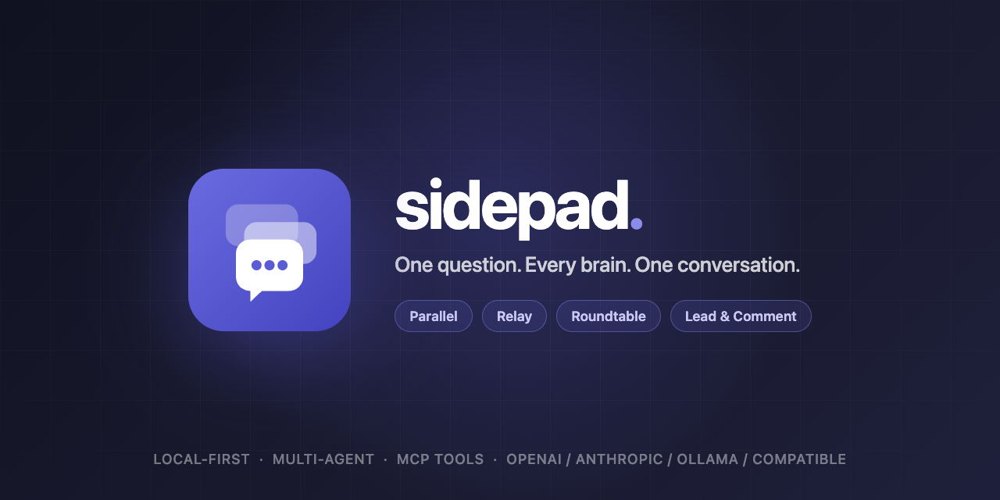

> **License**: PolyForm Noncommercial 1.0.0
> Copyright (c) 2026 godlockin
> 个人使用、二创、分发允许,需注明作者;**商业使用需作者书面授权**。
> 详见 [LICENSE](./LICENSE)。

<div align="center">



# sidepad

**One question. Every brain. One conversation.**

A local-first desktop cockpit where multiple LLM experts — same provider or different,
same model or not — answer, relay, debate, and critique **inside one conversation**,
with the framework itself planning model choice and reasoning effort per turn.

[](https://github.com/godlockin/sidepad/actions/workflows/ci.yml)


</div>

---

## Why sidepad?

| Pain | Typical tools | sidepad |
|------|--------------|---------|
| Locked into one model's blind spots | ChatGPT / Claude.ai — one answer, take it or leave it | Ask GPT, Claude, Gemini, DeepSeek, a local Llama **at the same time** — compare, contrast, decide |
| One model per conversation | Switching windows, copy-pasting between apps | **Multiple expert instances of the same model** — e.g. one GPT as *Architect*, another as *Critic* — collaborating in a single thread |
| Same flat settings for every question | Fixed model, fixed temperature | **Auto planning**: the framework routes easy turns to cheap models, hard turns to reasoning models with a deeper thinking budget |
| Cloud apps own your conversations | Everything synced to their servers | **Local-first, zero telemetry** — SQLite on your disk, keys in OS keychain encryption |

## The vision

> A cockpit where every project, conversation, and task is staffed by a team of AI
> experts you compose yourself — addressed like teammates with `@`, collaborating
> in the mode that fits the job, on models you choose, at the cost you control,
> with every byte staying on your machine.

Three layers make this real:

1. **Voices — your expert roster.** Register any provider (OpenAI, Anthropic, Ollama,
   or any OpenAI-compatible endpoint: DeepSeek, Qwen, GLM, Moonshot, OpenRouter…),
   then spawn *instances* of the same model wearing different personas
   (`@gpt::architect`, `@gpt::critic`), each with its own system prompt, skills,
   and tools.
2. **Modes — how the team works.**
   | Mode | What happens |
   |------|--------------|
   | **Parallel** | All addressed voices stream answers simultaneously |
   | **Relay** | A directed pipeline — each voice builds on the previous reply |
   | **Roundtable** | Discussion rounds: everyone weighs in, then reacts to each other |
   | **Lead & Comment** | One lead answers, the rest critique concurrently |
   | **Auto** | The framework plans it: task tier → model variety + reasoning effort |
3. **Governance — quality per token.** Multi-turn memory with visibility control,
   context-window budgeting with CJK-aware truncation, MCP tool calls flattened and
   capped on their way back to the model, and per-call reasoning-effort planning
   (OpenAI `reasoning_effort`, Anthropic `thinking.budget_tokens`, Ollama `think`)
   recorded in every message for audit.

## Features

- **Multi-provider registry** — OpenAI, Anthropic, Ollama, Azure, and any
  OpenAI-compatible endpoint, with presets, model probing, and capability chips
- **Expert instances** — same provider + model, different personas, separately
  addressable via `@provider::persona`
- **Four collaboration modes + auto routing** — parallel / relay / roundtable /
  lead-and-comment, or let the framework pick voice *and* thinking budget per turn
- **Reasoning effort planning** — `minimal → high` tiers mapped to each provider's
  native thinking parameters; light turns stop paying for deep thinking
- **MCP tool integration** — any stdio / HTTP / SSE MCP server; 5 bundled tools
  (4-backend web search, document reading, headless browser, site crawler, local RAG)
  with flattened, size-capped results and full usage audit
- **Context governance** — sliding window (30 turns) + token budget at 85 % of the
  model's real context window, per-session visibility (own answers vs. full room)
- **Rich chat surface** — streaming, reasoning traces, tool-call cards, attachments
  (PDF/Office/HTML/OCR), URL fetch, semantic knowledge base, fork & export,
  i18n (EN / 中文)
- **Local-first, zero telemetry** — WAL SQLite, `safeStorage`-encrypted API keys,
  no accounts, no cloud sync
- **Cross-platform** — macOS (arm64 + x64), Windows, Linux

## Providers

sidepad supports LLM providers through a layered architecture:

### Built-in providers

| Type | Protocol | Notes |
|------|----------|-------|
| `openai` | OpenAI Chat Completions | Direct connection |
| `anthropic` | Anthropic Messages | Direct connection |
| `ollama` | Ollama | Local server |
| `openai-compat` | OpenAI Chat Completions | Custom baseURL |
| `anthropic-messages` | Anthropic Messages | Custom baseURL — works with Minimax, self-hosted proxies |
| `gemini` | Gemini generateContent | Direct connection (Google AI Studio or Vertex) |

### Per-model overrides

For each provider, you can set per-model overrides via the **Advanced** section:

- **Extra Headers**: send custom HTTP headers with every request
- **Extra Body**: merge custom fields into the request body (JSON)

Both can be scoped per-model via `modelOverrides` (advanced users edit the JSON directly in the database).

### Adding a new vendor

To add a vendor (e.g. AWS Bedrock Claude), create `src/main/providers/base/`:

```ts
import { AnthropicBaseProvider } from '../base/anthropic-base';

export class AnthropicBedrockProvider extends AnthropicBaseProvider {
  constructor(id, configId, parsedParams) {
    super(id, configId, '', { baseURL: process.env.BEDROCK_ENDPOINT ?? '' }, parsedParams);
  }
  // override chat() to add SigV4 signing
  async *chat(req, signal) {
    // ... custom logic ...
  }
}
```

Then register in three places:

1. **`src/main/providers/factory.ts`** — add a `case` in the factory switch to construct the provider
2. **`src/main/ipc/routers/provider-router.ts`** — add the type to the `z.enum(...)` in `listModels`/`testModel`/`configure`, and add a `case` in each switch
3. **`src/renderer/components/ProviderForm.tsx`** — add the type to the `ProviderType` union and `<option>` list if exposing it in the UI dropdown

## Requirements

- Node 22 (`nvm use` — pinned in `.nvmrc`)
- npm 10+
- macOS / Windows / Linux

## Develop

```bash
nvm use
npm install
npm run dev          # electron-vite dev server with HMR
```

## Test

```bash
npm test             # vitest (unit + integration, 214 tests)
npm run typecheck    # tsc --noEmit on main + node configs
npm run test:e2e     # playwright (boots the built Electron app)
npm run test:e2e:regression  # passes on a fresh clone with NO API keys
npm run lint
```

The regression suite gates all cloud-dependent assertions behind env vars
(`AZURE_OPENAI_*`, `BRAVE_API_KEY`, `TAVILY_API_KEY`) and skips them when missing.

## Build & package

```bash
npm run build                # compile only (out/)
npm run package:mac-arm      # → release/sidepad-darwin-arm64/sidepad.app
npm run package:mac-x64      # → release/sidepad-darwin-x64/sidepad.app
npm run package:win          # → release/sidepad-win32-x64/sidepad.exe
npm run package:linux        # → release/sidepad-linux-x64/sidepad
```

Native modules (`better-sqlite3`) are rebuilt for Electron automatically. If you
switch between dev and packaged use: `npm run rebuild:electron` or
`npm run rebuild:node`.

## Release (CI)

Tag a version to trigger the multi-platform build + GitHub Release:

```bash
git tag v0.2.0
git push origin v0.2.0
```

`.github/workflows/release.yml` builds in parallel on `macos-14` (arm64),
`macos-13` (x64), `windows-latest`, and `ubuntu-latest`.

## Brand assets

Logo, app icon, and the social preview live in
[`resources/brand/`](resources/brand) (source SVG + rendered PNG/icns) and
[`.github/social-preview.png`](.github/social-preview.png).

---

## License

Private — not yet open-sourced.
